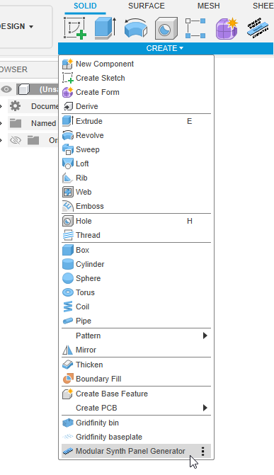

# Fusion Eurorack Panel Generator

[][latest-release]
[![CC BY-NC-SA 4.0][cc-by-nc-sa-shield]][cc-by-nc-sa]
[][coc]

## Description

TL;DR: This is a Eurorack panel generator [add-in][addins] for [Autodesk Fusion][fusion]

If you're like me and you like making DIY Eurorack modules but absolutely hate milling aluminum panels because little
bits of metal go flying everywhere and it's impossible to get all the holes to line up just right and it's just so damn
tedious, maybe this thing will help you out.

I've been 3D printing DIY Eurorack module panels for a while now, but until I made this add-in, I'd been copying and
pasting some manual template components over and over again, which resulted in a very large and very slow Fusion project
file.

## Features

With this add-in, you can...

- generate 3U and 1U (Intellijel) compatible Eurorack panels, suitable for 3D printing
- choose any width from 2 to 9000 HP
- set a custom panel thickness
- choose from two different reinforcement types, which each thicken the center area of the panel, while leaving the
  mounting screw area thickness unchanged:
  - `Shell`: This creates a hollow shell, leaving space inside for jacks and switches. Generally useful for sizes 4 HP
    and larger.
  - `Solid`: This works well for blanks or very narrow modules, where the shell approach wouldn't leave enough space for
    components.
- save custom default values for easy recall
- easily edit generated sketches to change the HP (or other) values or features to change extrusions, after-the-fact

Additional Notes:

- I print with PETG using a 0.4mm nozzle and 0.2mm layer height on a Bambu X1C, without issues.
- When using reinforcements, it'll probably be easiest if you print with the panel face down. 😛

## Usage

| 1️⃣ Open the add-in          | 2️⃣ Generate the panel         |
| --------------------------- | ----------------------------- |
|  |  |

Click to show screenshots of generated panels

| 3U 6HP Panel (no reinforcement) | 3U 2HP Panel (solid reinforcement)  | 3U 6HP Panel (shell reinforcement)  |
| ------------------------------- | ----------------------------------- | ----------------------------------- |
|   |  |  |

| 1U 12HP Panel (solid reinforcement)  | 3U 2HP Panel (solid reinforcement)     | 3U 6HP Panel (shell reinforcement)     |
| ------------------------------------ | -------------------------------------- | -------------------------------------- |
|  |  |  |

Click to show screenshots of generated sketches

| Example generated sketch         | Panel width HP in sketch is editable        |
| -------------------------------- | ------------------------------------------- |
|  |  |

## Requirements

- Requires parametric modeling (timeline) to be enabled. Does not work with direct modeling.
- Tested with Fusion 2603.1.31 (August, 2025) on Windows 11. Should work on other operating systems, but they are
  untested.

## Installation

### From Github

#### Step 1: Download

You have a few options:

**Option 1:** You just want to use the add-in

1. Download the `EurorackPanelGenerator-vX.Y.Z.zip` file from the [latest release][latest-release] page. Note that the
   `X.Y.Z` part will change based on the release version.
2. Unzip it. You can unzip anywhere, but the [Installing, Linking, and Removing Scripts and Add-Ins][addins-installing]
   documentation page has suggestions.

**Option 2:** You plan on contributing

1. Fork this repo.
2. Clone your fork. You can clone anywhere, but the [Installing, Linking, and Removing Scripts and
   Add-Ins][addins-installing] documentation page has suggestions.

#### Step 2: Install into Fusion

1. In Fusion open the `Scripts and Add-Ins` dialog by pressing `Shift + S` or going to
   `Utilities -> Add-Ins -> Scripts and Add-Ins` in the top menu of the Design workspace.
2. Click the `+` (plus) icon at the top of the `Scripts and Add-Ins` dialog and select `Script or add-in from device`.
3. Choose the folder created after unzipping / cloning. It will be named something like `EurorackPanelGenerator` or
   `EurorackPanelGenerator-vX.Y.Z` and will contain `lib`, `commands` and `resources` folders, as well as files like
   `EurorackPanelGenerator.manifest` and `EurorackPanelGenerator.py` (you may not be able to see some of the folder
   contents in the `+` file dialog).
4. Verify that you see the `EurorackPanelGenerator` add-in in the `Scripts and Add-Ins` dialog list.
5. Enable the `Run` option for the `EurorackPanelGenerator` add-in.

When done correctly, the Design workspace `Solid -> Create` menu should have a `Eurorack Panel Generator` option.

### From the Autodesk App Store

_(coming soon)_

## Update

To update this add-in, download the [latest release][latest-release] into the same location and relaunch Fusion.

## Contributing

This project follows the [Contributor Covenant 3.0 Code of Conduct][coc].

Useful links:

- [Fusion API User's Manual](https://help.autodesk.com/view/fusion360/ENU/?guid=GUID-C1545D80-D804-4CF3-886D-9B5C54B2D7A2)
- [Fusion API Reference Manual](https://help.autodesk.com/view/fusion360/ENU/?guid=GUID-7B5A90C8-E94C-48DA-B16B-430729B734DC)
- [Managing Scripts and Add-Ins][addins]

_(More to come, but in the meantime, if you give this a try and have any issues, please let me know)_

## Support the project

This add-in is free. However, if you want to support the project you can do so by
[buying me a coffee (or synthesizer)](https://buymeacoffee.com/benalman). Thanks!

## Credits

This work was heavily influenced by the
[FusionGridfinityGenerator](https://github.com/Le0Michine/FusionGridfinityGenerator) add-in. I did my best to solve
problems in my own way, but if you see similarities or outright duplicated code (or README content), don't be surprised.
There's no way I could've done this without studying that codebase.

## License

This work is licensed under the [Creative Commons Attribution-NonCommercial-ShareAlike 4.0 International
License][cc-by-nc-sa].

[![CC BY-NC-SA 4.0][cc-by-nc-sa-image]][cc-by-nc-sa]

[fusion]: https://www.autodesk.com/products/fusion-360
[addins]: https://help.autodesk.com/view/fusion360/ENU/?guid=GUID-9701BBA7-EC0E-4016-A9C8-964AA4838954
[addins-installing]:
  https://help.autodesk.com/view/fusion360/ENU/?guid=GUID-9701BBA7-EC0E-4016-A9C8-964AA4838954#Installing
[latest-release]: https://github.com/cowboy/fusion-eurorack-panel-generator/releases/latest
[cc-by-nc-sa]: http://creativecommons.org/licenses/by-nc-sa/4.0/
[cc-by-nc-sa-image]: https://licensebuttons.net/l/by-nc-sa/4.0/88x31.png
[cc-by-nc-sa-shield]: https://img.shields.io/badge/License-CC%20BY--NC--SA%204.0-lightgrey.svg
[coc]: https://github.com/cowboy/fusion-eurorack-panel-generator/blob/main/CODE_OF_CONDUCT.md
