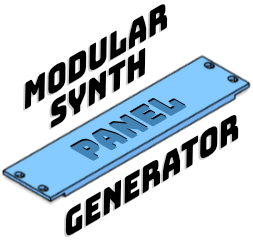
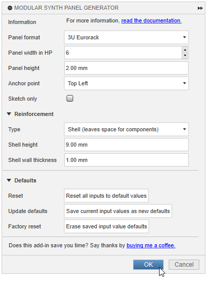

# Modular Synth Panel Generator

[][latest-release]
[![CC BY-NC-SA 4.0][cc-by-nc-sa-shield]][cc-by-nc-sa]
[][coc]

## Description



TL;DR: This is a modular synth panel generator [add-in][addins] for [Autodesk Fusion][fusion]

If you're like me and you like making DIY synth modules but absolutely hate milling aluminum panels because little bits
of metal go flying everywhere and it's impossible to get all the holes to line up just right and it's just so damn
tedious, maybe this thing will help you out.

I've been 3D printing DIY Eurorack module panels for a while now, but until I made this add-in, I'd been manually
copying and pasting "template" components over and over again, which resulted in a number of very large and very slow
Fusion project files.

## Features

With this add-in, you can...

- generate modular synth panels (currently Eurorack and 1U formats are supported), suitable for 3D printing (or CNC?)
- choose any width from 2 to 9000 HP
- set a custom panel thickness
- choose multiple reinforcement types, each of which thicken the center area of the panel, while leaving the panel
  thickness in the mounting screw area unchanged:
  - `Shell`: This creates a hollow shell, adding strength while leaving space inside for jacks and switches. Generally
    useful for 4 HP and larger panels.
  - `Solid`: This adds strength to larger blanks, or very narrow modules where the shell approach wouldn't leave enough
    space for components.
- save custom default values for easy recall
- easily edit generated sketches and features to change dimensions, after-the-fact

### Currently supported modular synth panel formats

| Format name                   | Reference Specification                                     |
| ----------------------------- | ----------------------------------------------------------- |
| 3U Eurorack                   | [Doepfer - A-100 Construction Details][doepfer-spec]        |
| 1U (Intellijel)               | [Intellijel - 1U Technical Specifications][intellijel-spec] |
| 1U Tile (Pulp Logic)          | [Pulp Logic - About 1U Tiles][pulplogic-spec]               |
| &lt;Your favorite format?&gt; | [Contributions welcome!](#contributing)                     |

### Additional Notes

- I print with PETG using a 0.4mm nozzle and 0.2mm layer height on a Bambu X1C, without issues.
- When using reinforcements, it'll probably be easiest if you print with the panel face down. 😛
- Pulp Logic tiles are meant to be made in multipes of 6 HP but I won't tell anyone if you make odd sizes.

## Usage

| 1️⃣ Open the add-in          | 2️⃣ Generate the panel                |
| --------------------------- | ------------------------------------ |
|  |  |

### Generated panel examples

| 3U 6HP Panel (no reinforcement) | 3U 2HP Panel (solid reinforcement)  | 3U 6HP Panel (shell reinforcement)  |
| ------------------------------- | ----------------------------------- | ----------------------------------- |
|   |  |  |

| 1U 12HP Panel (solid reinforcement)  | 3U 2HP Panel (solid reinforcement)     | 3U 6HP Panel (shell reinforcement)     |
| ------------------------------------ | -------------------------------------- | -------------------------------------- |
|  |  |  |

### Generated sketch examples

| Example generated sketch         | Panel width HP in sketch is editable        |
| -------------------------------- | ------------------------------------------- |
|  |  |

## Requirements

- Requires parametric modeling (timeline) to be enabled. Does not work with direct modeling.
- Tested with Fusion 2603.1.31 (August, 2025) on Windows 11. Should work on other operating systems, but they are
  untested.

## Installation

### From Github

#### Step 1: Download

You have a few options:

**Option 1:** You just want to use the add-in

1. Download the `ModularSynthPanelGenerator-vX.Y.Z.zip` file from the [latest release][latest-release] page. Note that
   the `X.Y.Z` part will change based on the release version.
2. Unzip it. You can unzip anywhere, but the [Installing, Linking, and Removing Scripts and Add-Ins][addins-installing]
   documentation page has suggestions.

**Option 2:** You plan on contributing

1. Fork this repo.
2. Clone your fork. You can clone anywhere, but the [Installing, Linking, and Removing Scripts and
   Add-Ins][addins-installing] documentation page has suggestions.

#### Step 2: Install into Fusion

1. In Fusion open the `Scripts and Add-Ins` dialog by pressing `Shift + S` or going to
   `Utilities -> Add-Ins -> Scripts and Add-Ins` in the top menu of the Design workspace.
2. Click the `+` (plus) icon at the top of the `Scripts and Add-Ins` dialog and select `Script or add-in from device`.
3. Choose the folder created after unzipping / cloning. It will be named something like `ModularSynthPanelGenerator` or
   `ModularSynthPanelGenerator-vX.Y.Z` and will contain `lib`, `commands` and `resources` folders, as well as files like
   `ModularSynthPanelGenerator.manifest` and `ModularSynthPanelGenerator.py` (you may not be able to see some of the
   folder contents in the `+` file dialog).
4. Verify that you see the `ModularSynthPanelGenerator` add-in in the `Scripts and Add-Ins` dialog list.
5. Enable the `Run` option for the `ModularSynthPanelGenerator` add-in.

When done correctly, the Design workspace `Solid -> Create` menu should have a `Eurorack Panel Generator` option.

### From the Autodesk App Store

_(coming soon)_

## Update

To update this add-in, download the [latest release][latest-release] into the same location and relaunch Fusion.

## Contributing

This project follows the [Contributor Covenant 3.0 Code of Conduct][coc].

Useful links:

- [Fusion API User's Manual](https://help.autodesk.com/view/fusion360/ENU/?guid=GUID-C1545D80-D804-4CF3-886D-9B5C54B2D7A2)
- [Fusion API Reference Manual](https://help.autodesk.com/view/fusion360/ENU/?guid=GUID-7B5A90C8-E94C-48DA-B16B-430729B734DC)
- [Managing Scripts and Add-Ins][addins]
- [Fusion 360 API Interactive Cheat Sheet](https://fusion360-api-cheatsheet.github.io/)

Development environment notes:

- Launch the editor ([Visual Studio Code][vscode]) from inside Fusion by opening the `Scripts and Add-Ins` dialog
  (`Shift + S`), right-clicking on the `ModularSynthPanelGenerator` and clicking `Edit in code editor`. This allows you
  to attach the vscode debugger to the running process as well as reload after you've made changes.
- I've tried to leave the boilerplate files generated by Fusion's `Create script or add-in` relatively untouched, so
  that the code can be as modular as possible. Unused boilerplate has been removed where possible.
- There are many seemingly extraneous `cast()` calls throughout the code to help 
  [Pylance](https://marketplace.visualstudio.com/items?itemName=ms-python.vscode-pylance) understand what's going on, because [many classes in the underlying adsk libraries aren't proper Enums](https://forums.autodesk.com/t5/fusion-api-and-scripts-forum/faulty-enum-types/m-p/12066483).
- I've been using a `.vscode/settings.json` file that looks like this, but it's gitignored because it constains local
  paths. AFAIK, there's no way to write these paths in a user or operating system agnostic way. Until there's a better
  solution, I recommend creating a throwaway Fusion add-in from the `Scripts and Add-Ins` dialog just to grab those
  paths, then create your own local `.vscode/settings.json` file in this project using the paths it generates. You'll
  probably also want to add in the other stuff from here, to be consistent.

```json
{
  "python.autoComplete.extraPaths": ["C:/Users/Cowboy/AppData/Roaming/Autodesk/Autodesk Fusion 360/API/Python/defs"],
  "python.analysis.extraPaths": ["C:/Users/Cowboy/AppData/Roaming/Autodesk/Autodesk Fusion 360/API/Python/defs"],
  "python.defaultInterpreterPath": "C:/Users/Cowboy/AppData/Local/Autodesk/webdeploy/production/7627f627889be835182cfc345110c3c9f5bc9cc3/Python/python.exe",
  "files.exclude": {
    "**/__pycache__/": true,
    "**/*.py[codz]": true,
    "**/*$py.class": true
  },
  "editor.tabSize": 4,
  "editor.defaultFormatter": "charliermarsh.ruff",
  "ruff.lineLength": 160,
  "python.analysis.typeCheckingMode": "standard",
  "python.analysis.diagnosticsSource": "Pylance"
} 
```

Files of interest:

| File                                                                    | Description                                                                                                                                           |
| ----------------------------------------------------------------------- | ----------------------------------------------------------------------------------------------------------------------------------------------------- |
| [commands/commandDialog](/commands/commandDialog)                       | Boilerplate command code generated by Fusion. You likely won't be touching these files.                                                               |
| [lib/panelUtils/panel_command.py](/lib/panelUtils/panel_command.py)     | Most of the command code that would have gone into the boilerplate command `entry.py` file. This is where the main dialog is initialized and updated. |
| [lib/panelUtils/panel_options.py](/lib/panelUtils/panel_options.py)     | `PanelOptions` class with panel options and constants, including convenience getters/setters for ui dialog imputs.                                    |
| [lib/panelUtils/panel_generate.py](/lib/panelUtils/panel_generate.py)   | Code that actually generates the panel, including the sketch and extrusions.                                                                          |
| [lib/generalUtils/debug_utils.py](/lib/generalUtils/debug_utils.py)     | Debugging utilities                                                                                                                                   |
| [lib/generalUtils/extrude_utils.py](/lib/generalUtils/extrude_utils.py) | Extrusion utilities                                                                                                                                   |
| [lib/generalUtils/persist_utils.py](/lib/generalUtils/persist_utils.py) | `Persistable` class for persisting defaults to disk                                                                                                   |
| [lib/generalUtils/sketch_utils.py](/lib/generalUtils/sketch_utils.py)   | Sketch utilities                                                                                                                                      |
| [lib/generalUtils/value_utils.py](/lib/generalUtils/value_utils.py)     | Value normalization utilities                                                                                                                         |

_(More to come, but in the meantime, if you give this a try and have any issues, please let me know)_

## Support the project

This add-in is free. However, if you want to support the project you can do so by
[buying me a coffee (or synthesizer)](https://buymeacoffee.com/benalman). Thanks!

## Credits

This work was heavily influenced by the
[FusionGridfinityGenerator](https://github.com/Le0Michine/FusionGridfinityGenerator) add-in. I did my best to solve
problems in my own way, but if you see similarities in the code or README, don't be surprised. There's no way I could've
done this without studying that codebase. I honestly didn't even know Fusion add-ins were a thing until I stumbled
across that project. Yay!

## License

This work is licensed under the [Creative Commons Attribution-NonCommercial-ShareAlike 4.0 International
License][cc-by-nc-sa].

[![CC BY-NC-SA 4.0][cc-by-nc-sa-image]][cc-by-nc-sa]

[fusion]: https://www.autodesk.com/products/fusion-360
[addins]: https://help.autodesk.com/view/fusion360/ENU/?guid=GUID-9701BBA7-EC0E-4016-A9C8-964AA4838954
[addins-installing]:
  https://help.autodesk.com/view/fusion360/ENU/?guid=GUID-9701BBA7-EC0E-4016-A9C8-964AA4838954#Installing
[latest-release]: https://github.com/cowboy/ModularSynthPanelGenerator/releases/latest
[cc-by-nc-sa]: http://creativecommons.org/licenses/by-nc-sa/4.0/
[cc-by-nc-sa-image]: https://licensebuttons.net/l/by-nc-sa/4.0/88x31.png
[cc-by-nc-sa-shield]: https://img.shields.io/badge/License-CC%20BY--NC--SA%204.0-lightgrey.svg
[coc]: https://github.com/cowboy/ModularSynthPanelGenerator/blob/main/CODE_OF_CONDUCT.md
[vscode]: https://code.visualstudio.com/
[doepfer-spec]: https://www.doepfer.de/a100_man/a100m_e.htm
[pulplogic-spec]: https://pulplogic.com/1u_tiles/
[intellijel-spec]: https://intellijel.com/support/1u-technical-specifications/
